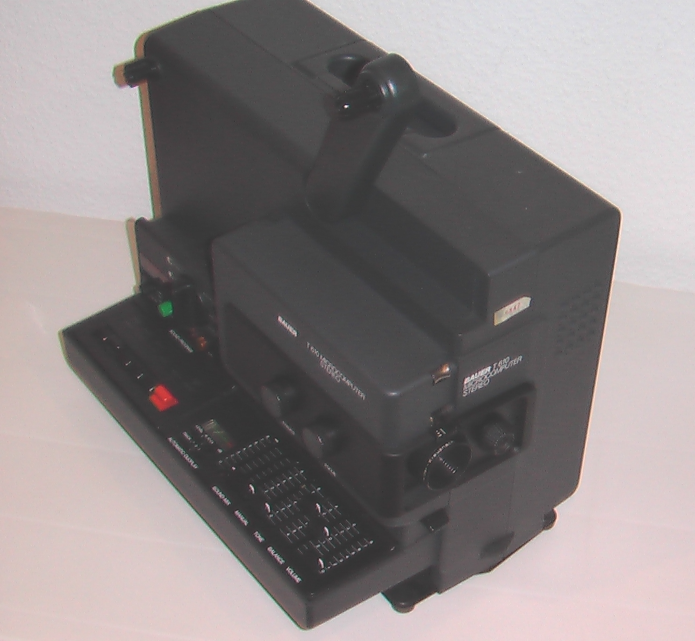
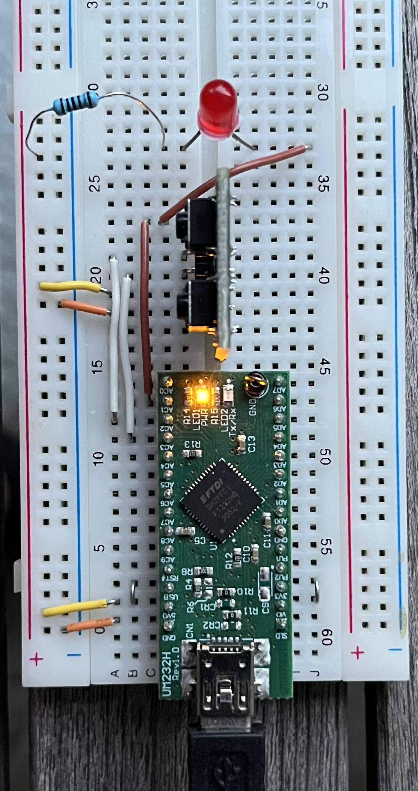

# beck-view-digitalize
Digitalize Super 8 films with Python &amp; OpenCV &amp; reactivex &amp; Adafruit FT232H Breakout Board

# Project Summary

This application can digitalize Super 8 films. A Super 8 projector has been modified for this purpose. A
USB-camera is mounted in front of the lens of the projector. When a frame is positioned behind the lens and 
at rest, an opto-coupler delivers a signal to a connected Adafruit FT232H Microcontroller. This signal is used
to trigger the USB-camera to take a picture of the currently visible frame. OpenCV is used for processing the image.




Von Joergsam - Eigenes Werk, CC BY-SA 3.0, [Wikimedia Commons](https://commons.wikimedia.org/w/index.php?curid=18493617) - unmodified sample of a Super  8 projector

The circuit diagram looks like so

The FT232H Board is connected via USB-C to the computer. It delivers the opto-coupler signals
to the computer, where openCV is used to control the USB-camera and for image processing. 
- The opto-coupler OK1 (connected to GPIO C2 as input) synchronizes the image capture
- The opto-coupler Ok2 (connected to GPIO C3 as input) delivers an end of film signal
- The LED (connected to GPIO C1 as output) is switched on while an image is processed

There are many other use cases for this application. You can use this project to take 
pictures from any USB-camera connected to your computer by the press of a button or 
in specified time intervals (timelapse), or you could take a picture when signalled by a sensor, e.g. an opto-coupler.

In a second step this project allows you to reassemble the list of pictures into a movie, again.

# Project  Installation

<alert style="background:yellow">Follow the Blinka installation instructions precisely. It will save you time!</alert>

## Prerequisites

The FT232H Breakout Board is connected via USB to your computer.

## Tools

Python3 and pip3 have to be installed first.

Use the current version of pip.

```
pip3 install --upgrade pip
```

## BLINKA

Blinka is a pip installable Python library that runs in normal "desktop" Python. Blinka is  a
great library!

On Windows, macOS, or Linux computers, you can use USB adapter boards like the 
FT232H Adafruit breakout board, to provide hardware pins you can control. This board 
connects via regular USB to your computer, and let you do GPIO, I2C, SPI, and other hardware operations.

[Overview of supported hardware](https://circuitpython.org/blinka)

Follow the guide section specific to your platform and make sure Blinka is properly
installed before attempting to install any libraries.

[Blinka installation instructions](https://learn.adafruit.com/circuitpython-on-any-computer-with-ft232h/setup)

Before you proceed, check that the environment variable BLINKA is set as described in the installation guide.

## PyFtdi for FT232H

The FT232H is a general purpose USB to GPIO, SPI, I2C - USB-C & Stemma QT breakout board. The FT232H microcontroller 
connects to your computer via USB-C. See the link [Adafruit FT232H Breakout Board](https://www.adafruit.com/product/2264) 
to come to know the capabilities of this microcontroller.

The breakout board ist based on the chip manufactured by [FTDI Chip](https://ftdichip.com/products/ft232hq/). A lot of
additional documentation, e.g. the datasheet and references to drivers are also available on this site.

This project is coded in Python. The PyFTDI library cannot be praised enough. It has a terrific support for the FT232H, FT2232H and FT4232H devices.
A detailed step-by-step instruction on how to install PyFTDI for Windows, macOS or Linux can be found here:

[PyFtdi Documentation](https://eblot.github.io/pyftdi/)

When stuck, troubleshooting hints from the Arduino Help Center might be a door opener

[Install or update FTDI drivers](https://support.arduino.cc/hc/en-us/articles/4411305694610-Install-or-update-FTDI-drivers)
### FT232H EEPROM

The EEPROM of the FT232H should be initialized. 

The [User_Guide_For_FT_PROG.pdf](https://ftdichip.com/wp-content/uploads/2020/07/AN_124_User_Guide_For_FT_PROG.pdf)
gives a detailed description on how to do this using the
[FT_PROG - EEPROM Programming Utility](https://ftdichip.com/utilities/).

###  macOS (Intel)

Make sure libusb is installed.  See [Homebrew Formulae libusb](https://formulae.brew.sh/formula/libusb)
```
brew install libusb
```
The output from `brew ls libusb` should look like so
```
/usr/local/Cellar/libusb/1.0.26/include/libusb-1.0/libusb.h
/usr/local/Cellar/libusb/1.0.26/lib/libusb-1.0.0.dylib
/usr/local/Cellar/libusb/1.0.26/lib/pkgconfig/libusb-1.0.pc
/usr/local/Cellar/libusb/1.0.26/lib/ (2 other files)
/usr/local/Cellar/libusb/1.0.26/share/libusb/ (9 files)
```

## Python Packages 

Blinka

```
pip3 install adafruit-blinka
```

PyUSB
```
pip3 install pyusb==1.1.0
```

PyFtdi
```
pip3 install pyftdi
```

OpenCV
```
pip3 install opencv-python
```

NumPy should have been installed along with OpenCV. If that had not been the case add numpy yourself
```
pip3 install numpy
```

ReactiveX is being used to parallelize processes
```
pip3 install reactivex
```

## Update Packages

### MacOS
```
pip3 list outdated --format=freeze | grep -v '^\-e' | cut -d = -f 1 | xargs -n1 pip3 install -U 
```
# Step By Step Description

## Take A Photograph At The Press Of A Button

A simple start to check if everything is set up fine.

ToDo: Detailed description




