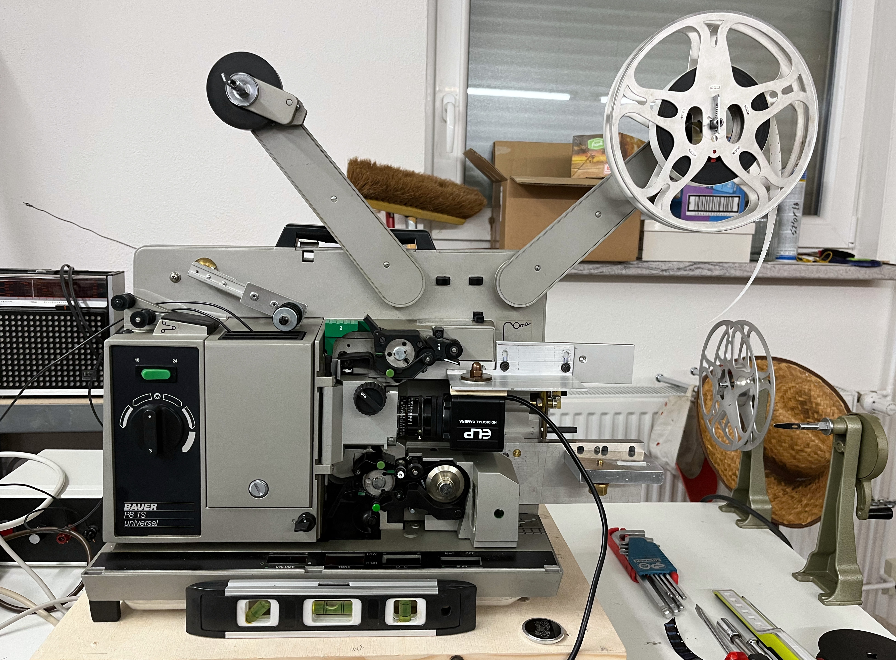
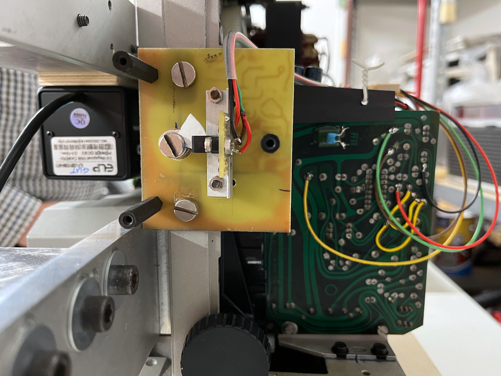
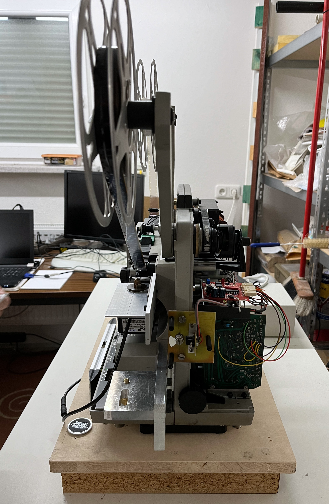
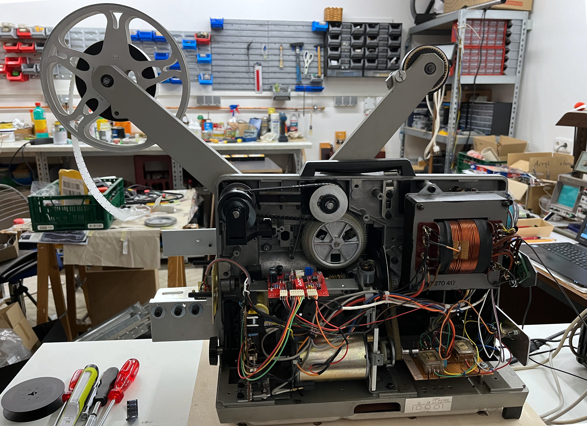
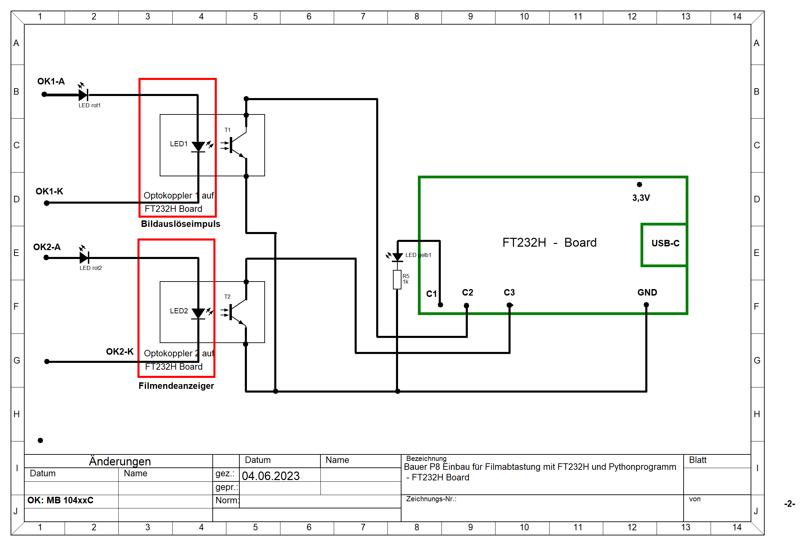
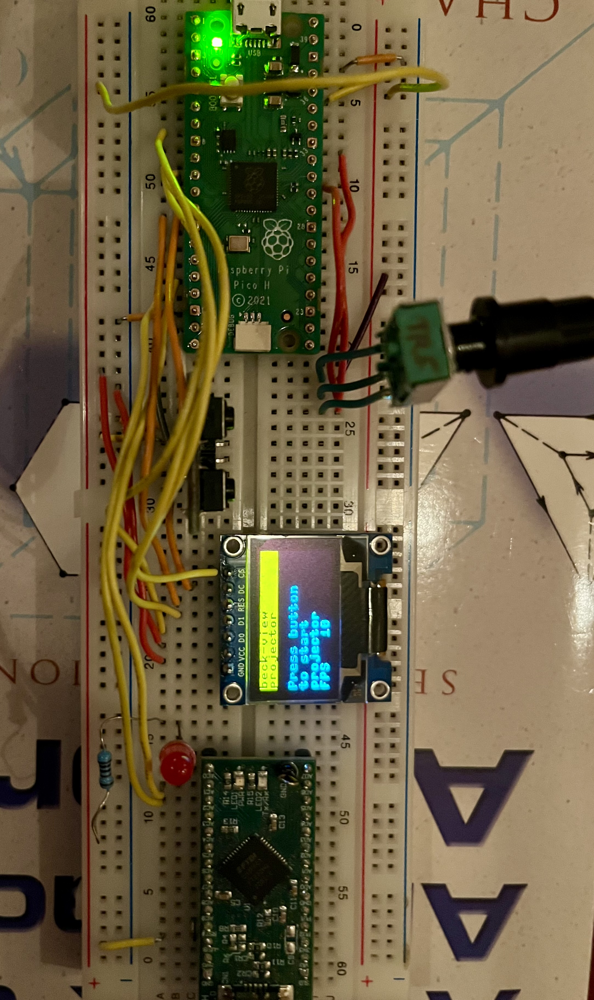
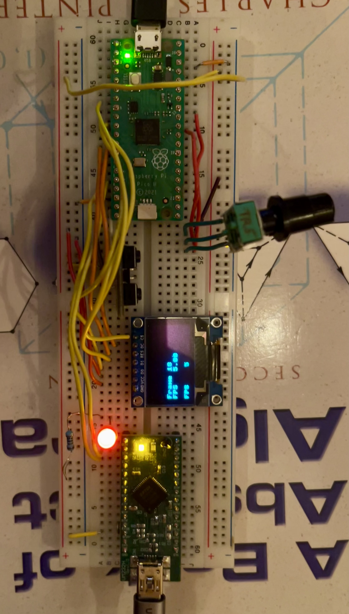
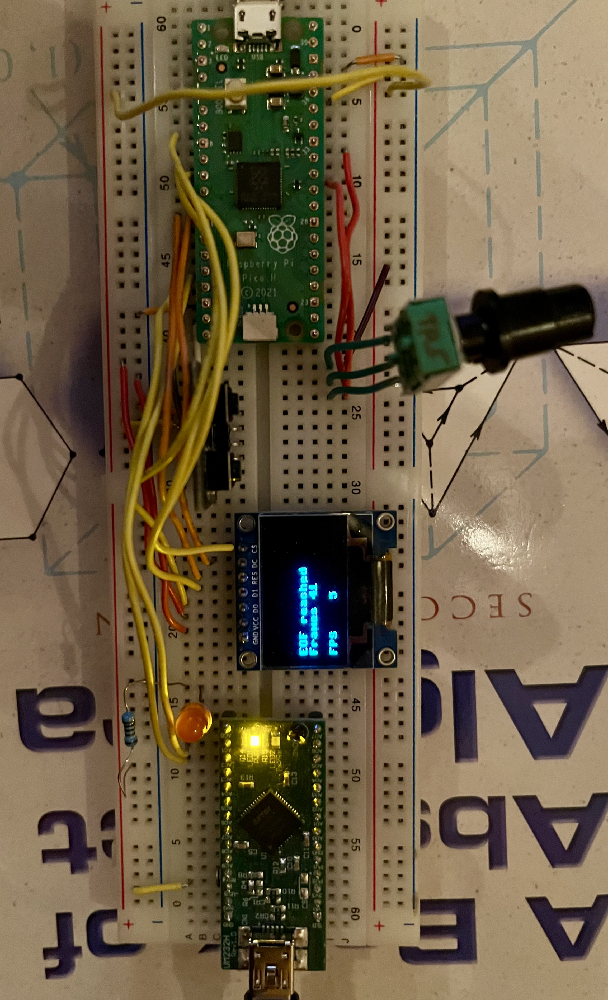

# Beck-View Digitalize

Digitize Super 8 films with **Cython**, OpenCV, ReactiveX, PyFtdi, and the Adafruit FT232H Breakout Board.

## Project Summary

This application is designed to digitalize Super 8 films. A modified Super 8 projector is equipped with a USB camera mounted in front of its lens. When a frame is positioned and at rest, an opto-coupler sends a signal to an Adafruit FT232H Microcontroller, which triggers the USB camera to capture the frame. The captured image is then processed using OpenCV.

To improve the overall performance, **Cython** has been integrated into the project. This migration from Python to Cython allows for faster execution of the core processing routines, making the image capture and processing pipeline more efficient.

The captured images can be reassembled into a movie with [Beck-View-Movie](https://github.com/JuPfu/beck-view-movie).

## Using Cython in This Project

### Why Cython?

Cython provides an easy way to significantly boost the performance of your Python code by converting it into C. It is particularly useful when working with computationally intensive tasks, such as image processing in this project.

By integrating Cython into **Beck-View Digitalize**, the speed of processing frames has increased compared to the pure Python version.

### Setting Up Cython

1. **Install Cython:**

   Ensure that Cython is installed in your environment:
   ```bash
   pip install cython
   ```

2. **Compiling the Cython Code:**

   In this project, certain modules are implemented in Cython to enhance performance. To compile the Cython `.pyx` files into C and then build the extension, follow these steps:

   ```bash
   python setup.py build_ext --inplace
   ```

   The `setup.py` file provided in the repository is already configured for compiling the Cython files.


3. **Using Cython-Compiled Code:**

   Once compiled, the Cython modules are used just like normal Python modules, but with significantly improved performance. The rest of the project usage remains the same.

### Further Reading on Cython

- [Cython Documentation](https://cython.readthedocs.io/en/latest/) – Learn more about how Cython works and how to use it.
- [Cython Tutorials](https://cython.readthedocs.io/en/latest/src/tutorial/index.html) – Step-by-step guides to help you get started.
- [Optimizing Python Code with Cython](https://cython.readthedocs.io/en/latest/src/tutorial/profiling_tutorial.html) – Explore ways to profile and optimize Python code with Cython.


*Image: By Jürgen Pfundt & Gerald Beck - Own work - Projector with mounted camera


*Image: By Jürgen Pfundt  & Gerald Beck - Own work - Optocoupler synchronized with rotating shutter.


*Image: By Jürgen Pfundt  & Gerald Beck - Own work - Front view with spring damped wooden platform


*Image: By Jürgen Pfundt & Gerald Beck - Own work - 'Beck View' of projector

The circuit diagram:


The FT232H board connects via USB-C to a computer. It transmits opto-coupler signals to the computer, where OpenCV controls the USB camera and processes images.

- **OK1 (GPIO C2):** Synchronizes image capture
- **OK2 (GPIO C3):** Signals end of film
- **LED (GPIO C1):** Lights up while processing an image

With some adaptions this application can also be used for other purposes, such as taking pictures with a USB camera when a button is pressed, or at specified intervals (timelapse), or when triggered by a sensor.

You can reassemble the captured images into a movie with [Beck-View-Movie](https://github.com/JuPfu/beck-view-movie).

## Project Installation

### Prerequisites

Ensure the FT232H Breakout Board is connected via USB to your computer.

### Tools

Python 3 and pip must be installed. Upgrade pip to the latest version:
```bash
pip3 install --upgrade pip
```

### Installation Steps

1. **Clone the Repository:**
   ```bash
   git clone https://github.com/JuPfu/beck-view-digitalize.git
   cd beck-view-digitalize
   ```

<a id="install_dependencies"></a>
2. **Install Dependencies:**
   ```bash
   pip install -r requirements.txt
   ```

### Additional Manual Installation Steps

Driver installation
   - For Windows, install the FT232H driver by means of [Zadig](#zadig).
   - For macOS, install the [libusb](#libusb) library via  [brew](https://brew.sh).

The next chapters give some background about the libraries used and some detailed installation instructions in case of problems.

### Detailed Installation Instructions

#### PyFtdi for FT232H

PyFtdi aims at providing a user-space driver for popular FTDI devices, implemented in pure Python language.
Supported FTDI devices include the FT232H Adafruit Breakout board.

In case of problems install PyFtdi for your platform using the [PyFtdi Documentation](https://eblot.github.io/pyftdi/).

<a id="zadig"></a>
#### Fix Driver with Zadig (Windows)

To fix the FT232H driver on Windows, use [Zadig](https://learn.adafruit.com/circuitpython-on-any-computer-with-ft232h/windows).

For troubleshooting, refer to the [Arduino Help Center](https://support.arduino.cc/hc/en-us/articles/4411305694610-Install-or-update-FTDI-drivers).

<a id="libusb"></a>
#### libusb for macOS

Install libusb using Homebrew:
```bash
brew install libusb
```

Verify the installation with:
```bash
brew ls libusb
```

Expected output:
```
/usr/local/Cellar/libusb/1.0.26/include/libusb-1.0/libusb.h
/usr/local/Cellar/libusb/1.0.26/lib/libusb-1.0.0.dylib
/usr/local/Cellar/libusb/1.0.26/lib/pkgconfig/libusb-1.0.pc
/usr/local/Cellar/libusb/1.0.26/lib/ (2 other files)
/usr/local/Cellar/libusb/1.0.26/share/libusb/ (9 files)
```

### Validation

#### Taking a Photograph with a Press of a Button

An easy way to test the application without a modified Super V8 projector at hand is to use the simple
circuit shown in the following images. Attach the FT232H Breakout board to a USB port of your computer.
When starting the program supply the device number of your camera via the `-d` option. At the moment you have to  guess
the device id. Start  with `0` (default if no device id is specified) and increment the device id by `1` until the
preferred USB camera is activated. Eligible cameras are the builtin camera of your notebook, a connected
USB-camera or on macOS an IPhone can also be selected, if in the same Wi-Fi.

Ensure everything is set up correctly by taking an image. Each pressing of the left button simulates a signal of an 
opto-coupler. The `Ft232hConnector` class receives the signal and sends it to your computer. The `DigitizeVideo` class 
handles the streams of signals. On each signal from the FT232H microcontroller the configured USB-camera is requested to
take a picture. A press on the right button (end of film) terminates the program.


#### Using a Projector Simulator for Triggering Photographs

A more complex way to simulate a projector is explained in [Beck-View-Projector](https://github.com/JuPfu/beck-view-projector).
A Raspberry Pi Pico, a SPI Oled display and a potentiometer are used to generate periodic signals which are send to the computer the Ft232h Controller is connected to. On each event received the beck-view-digitalize program requests a pictures from a
USB camera attached to the computer. By rotating the potentiometers knob the frequency of the periodic signals emitted can be regulated.


*Image: By Jürgen Pfundt & Gerald Beck - Own work - Raspberry Pi Pico used to generate periodic signals which trigger simulate a Super V8 projector


*Image: By Jürgen Pfundt & Gerald Beck - Own work - Raspberry Pi Pico used to simulate a Super V8 projector


*Image: By Jürgen Pfundt & Gerald Beck - Own work - Raspberry Pi Pico used to simulate a Super V8 projector

## Contributing

Feel free to fork this repository and contribute by submitting pull requests. 
For major changes, please open an issue first to discuss what you would like to change.

1. **Fork the Repository**
2. **Create a Feature Branch:**
   ```bash
   git checkout -b feature/your-feature
   ```
3. **Commit Changes:**
   ```bash
   git commit -m 'Add some feature'
   ```
4. **Push to the Branch:**
   ```bash
   git push origin feature/your-feature
   ```
5. **Open a Pull Request**

## License

This project is licensed under the MIT License. See the [LICENSE](LICENSE) file for details.

## Acknowledgements

- Thanks to the contributors of [NumPy](https://numpy.org/), [OpenCV](https://opencv.org/), [ReactiveX](https://reactivex.io/), [PyFtdi](https://eblot.github.io/pyftdi/installation.html), and [Adafruit](https://www.adafruit.com/) for their libraries and support.

---

Follow these instructions to set up and use the Beck-View Digitalize application for digitizing Super 8 films or other image capture projects. Happy digitizing!