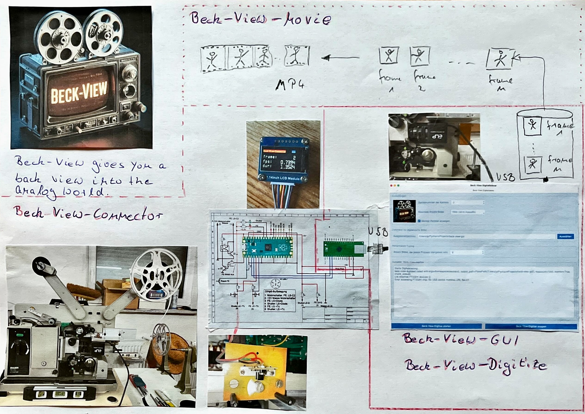

# Beck-View-Digitize

Digitize 16 mm films using **Cython**, **OpenCV**, **ReactiveX**, **PyFtdi**, and an **FT232H breakout board**.

---

## Project Summary

Beck-View-Digitize is designed to digitize 16 mm film using a mechanically modified projector and a USB camera.

A USB camera is mounted in front of the projector lens. When a film frame is positioned and mechanically at rest, an opto-coupler sends a signal to an **FT232H** microcontroller. This signal triggers the capture of a single frame via the USB camera. The captured image is processed using **OpenCV** and written to disk in **PNG format**.

To achieve sustained high frame rates, the project integrates **Cython** for performance-critical code paths. Migrating selected components from Python to Cython significantly improves execution speed and reduces overhead in the image capture and processing pipeline.

Captured image sequences can be reassembled into a movie using
[Beck-View-Movie](https://github.com/JuPfu/beck-view-movie).



---

## Building Beck-View-Digitize

Beck-View-Digitize combines Python, Cython, and native libraries to achieve high-performance film digitisation.

This section explains how to build the project on:

* **Windows**
* **macOS**
* **Linux**

The repository provides platform-specific helper scripts:

* `install.bat` (Windows)
* `install.sh` (macOS / Linux)

These scripts:

* create a Python virtual environment
* install Python dependencies
* build the Cython extensions in place

⚠️ Native dependencies (notably **libpng**) must be installed separately.

---

## Prerequisites (All Platforms)

* Python **3.10 or newer** (64-bit recommended)
* Git
* Native C compiler

  * Windows: MSVC (Visual Studio Build Tools)
  * macOS: Xcode Command Line Tools
  * Linux: GCC or Clang

Using a Python virtual environment is **strongly recommended**.

---

### Clone the Repository

```bash
git clone https://github.com/JuPfu/beck-view-digitalize.git
cd beck-view-digitalize
```

---

## Windows

### 1. Install Python

Download Python from:

[https://www.python.org/downloads/windows/](https://www.python.org/downloads/windows/)

During installation:

* Enable **“Add Python to PATH”**
* Ensure **pip** is installed

Verify:

```powershell
python --version
pip --version
```

---

### 2. Install Visual Studio Build Tools (MSVC)

Cython extensions and libpng require a native compiler.

Download **Visual Studio Build Tools** from:

[https://visualstudio.microsoft.com/visual-cpp-build-tools/](https://visualstudio.microsoft.com/visual-cpp-build-tools/)

During setup, enable:

* Desktop development with C++
* MSVC v143 (or newer)
* Windows 10/11 SDK

---

### 3. Install libpng Using vcpkg

Beck-View-Digitize uses **libpng directly** for high-performance PNG writing.
On Windows, **vcpkg** is the recommended and tested installation method.

#### Install vcpkg

```powershell
git clone https://github.com/microsoft/vcpkg.git
cd vcpkg
bootstrap-vcpkg.bat
```

Optional but recommended:

```powershell
vcpkg integrate install
```

#### Install libpng

Make sure the triplet matches your Python architecture (usually `x64`):

```powershell
vcpkg install libpng:x64-windows
```

This installs:

* `png.h`
* `libpng16.lib`
* required zlib dependencies

---

### 4. Build Beck-View-Digitize (Windows)

From the project root directory:

```powershell
install.bat
```

The script will:

* create a virtual environment
* install Python dependencies
* build all Cython extensions

---

### 5. Verify the Build

On each platform, the install script generates a native executable.

A simple verification step is to run the executable with the `--help` option:

```powershell
beck-view-digitize.exe --help
```

This is not a full functional test, but it confirms that:

* the executable was built successfully
* required native libraries are available at runtime
* the program starts correctly

If the help text is displayed, the build can be considered successful.

---

## macOS

### 1. Install System Dependencies

```bash
xcode-select --install
brew install python libpng libusb
```

---

### 2. Build Beck-View-Digitize

```bash
chmod +x install.sh
./install.sh
```

Homebrew provides the required `libpng` and `libusb` headers and libraries.

---

### 3. Verify the Build

```bash
./beck-view-digitize --help
```

---

## Linux (Debian / Ubuntu)

### 1. Install System Packages

```bash
sudo apt update
sudo apt install -y \
    python3 python3-venv python3-dev \
    build-essential \
    libpng-dev \
    libusb-1.0-0-dev
```

---

### 2. Build Beck-View-Digitize

```bash
chmod +x install.sh
./install.sh
```

---

### 3. Verify the Build

```bash
./beck-view-digitize --help
```

---

## Linux: USB Permissions for FT232H (udev Rules)

On Linux, Beck-View-Digitize accesses the FT232H device directly via USB.
Without additional configuration, this requires **root privileges**.

To allow access for normal users, a **udev rule** must be installed.

### Identify the Device

```bash
lsusb
```

Expected entry:

```
ID 0403:6014 Future Technology Devices International, Ltd FT232H
```

### Install the udev Rule

Create or edit the rules file:

```bash
sudo nano /etc/udev/rules.d/11-ftdi.rules
```

Add:

```text
SUBSYSTEM=="usb", ATTR{idVendor}=="0403", ATTR{idProduct}=="6014", MODE="0666", GROUP="plugdev"
```

Reload rules:

```bash
sudo udevadm control --reload-rules
sudo udevadm trigger
```

Unplug and reconnect the device.

If access is denied, ensure your user is in the `plugdev` group.

---

## Windows: Installing the libusb-win32 Driver for FT232H

On Windows, Beck-View-Digitize requires a **libusb-win32 compatible driver** for the FT232H.

### Steps Overview

1. Install the official FTDI CDM driver
2. Download and run **Zadig**
3. Replace the FTDI driver with **libusb-win32**

### Install FTDI Driver

Download from:

[https://ftdichip.com/drivers/](https://ftdichip.com/drivers/)

Install and reboot if required.

---

### Install Zadig

Download Zadig from:

[https://zadig.akeo.ie/](https://zadig.akeo.ie/)

Run `zadig.exe` as **Administrator**.

---

### Replace the Driver

1. Enable **Options → List All Devices**
2. Select the FT232H device
3. Choose **libusb-win32**
4. Click **Replace Driver**

After completion, the device should appear under **libusb-win32 devices** in Device Manager.

---

## Hardware Overview


*Projector with mounted USB camera*


*Opto-coupler synchronized with the rotating shutter*


*Spring-damped camera platform*


*Front view of the Beck-View setup*

### Circuit Diagram


The FT232H connects via USB-C and provides:

* **GPIO D6**: Frame synchronization
* **GPIO D7**: End-of-film signal

---

## Notes

* The libpng-based writer is essential for sustained frame rates
* PNG filters are disabled by default for performance
* Shared memory is used to avoid unnecessary data copies
* MSVC + vcpkg provides the most reproducible Windows build

---

## Contributing

Contributions are welcome.

1. **Fork the repository**
2. **Create a Feature Branch:**
   ```bash
   git checkout -b feature/your-feature
   ```
3. **Commit your changes**
   ```bash
   git commit -m 'Add some feature'
   ```
4. **Push and open a pull request**
   ```bash
   git push origin feature/your-feature
   ```

---

## License

MIT License — see [LICENSE](LICENSE)

---

## Acknowledgements


Thanks to the contributors of
* [NumPy](https://numpy.org/), 
* [OpenCV](https://opencv.org/), 
* [ReactiveX](https://reactivex.io/), 
* [PyFtdi](https://eblot.github.io/pyftdi/installation.html) 
* [libpng](https://www.libpng.org/pub/png/libpng.html) 

for their libraries and support.

---